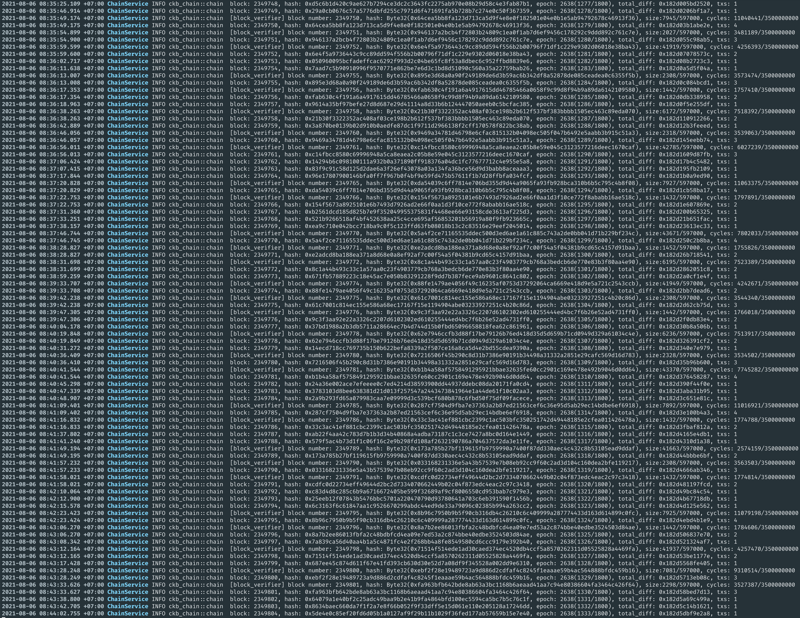

# Task 0

1. A screenshot of the console output from your local Testnet CKB Node after it has fully synchronized with the network.

2. A screenshot of the console output from your local CKB Indexer after it has fully synchronized with the local Testnet CKB Node. 
