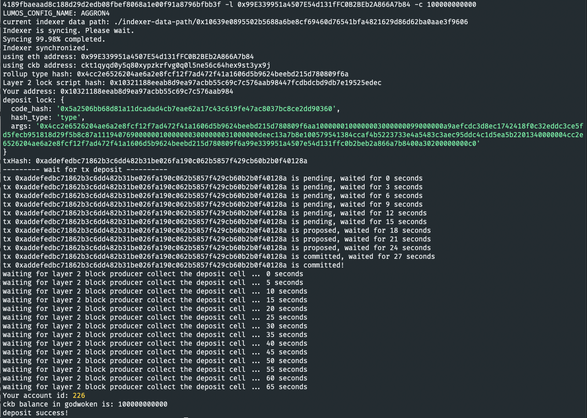

# TASK 1

1. A screenshot of the accounts you created (account list) in ckb-cli

2. A link to the Layer 1 address you funded on the Testnet Explorer.
[https://explorer.nervos.org/aggron/address/ckt1qyqd0y5q80xypzkrfvg0q0l5ne56c64hex9st3yx9j](https://explorer.nervos.org/aggron/address/ckt1qyqd0y5q80xypzkrfvg0q0l5ne56c64hex9st3yx9j)`
`

3. A screenshot of the console output immediately after you have successfully submitted a deposit to Layer 2.
