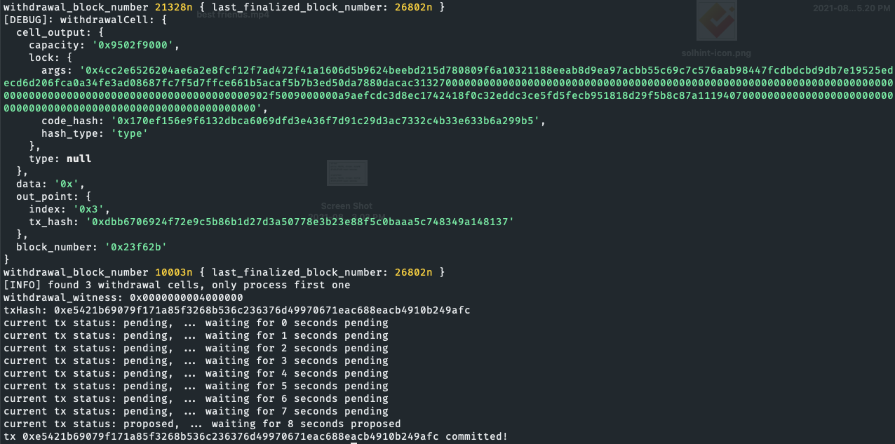

# Task 10

1. A screenshot of the console output immediately after running the "unlock" command.  

3. The Ethereum address that you've used for your Layer 2 account (in text format).  
[0x99E339951a4507E54d131fFC0B2BEb2A866A7b84](./eth-address.txt)

4. The Nervos Layer 1 address associated with the private key passed to "unlock" command (in text format). This is "ckb address" in the console output.  
[ckt1qyqd0y5q80xypzkrfvg0q0l5ne56c64hex9st3yx9j](./layer-1-address.txt)

