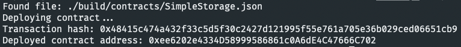

# Task 2

1. A screenshot of the console output immediately after you have successfully deployed a smart contract.


2. The transaction hash from the contract deployment (in text format).
```
0x48415c474a432f33c5d5f30c2427d121995f55e761a705e36b029ced06651cb9
```

3. The deployed contract address from the contract deployment (in text format).
```
0xee6202e4334D58999586861c0A6dE4C47666C702
```