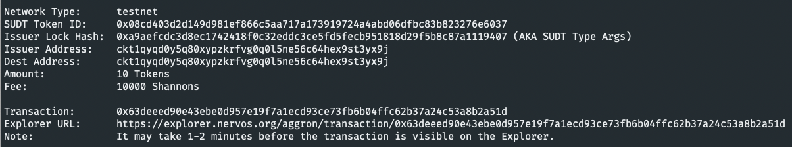
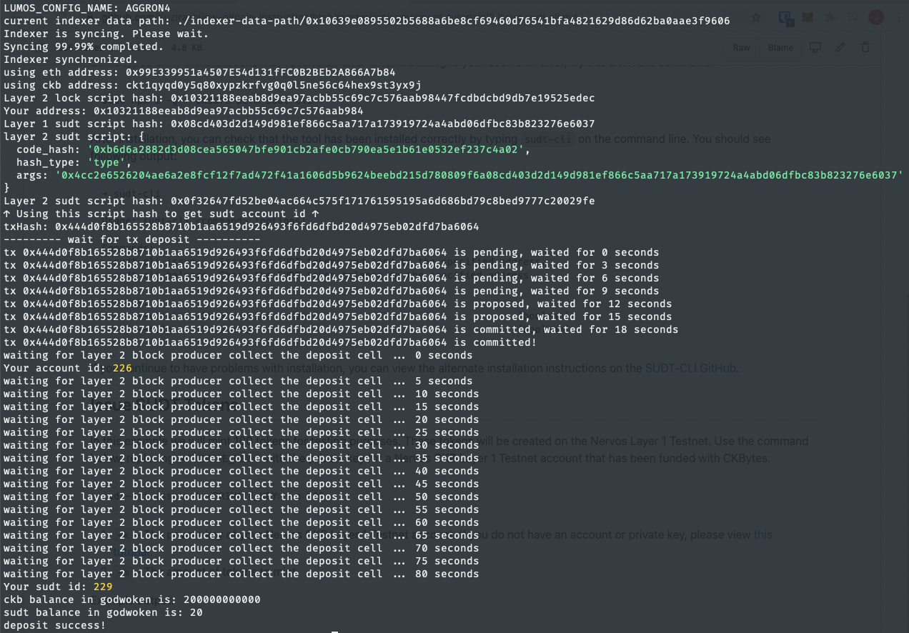

# Task 4

1. A link to the Layer 1 address you funded on the Testnet Explorer.
[https://explorer.nervos.org/aggron/address/ckt1qyqd0y5q80xypzkrfvg0q0l5ne56c64hex9st3yx9j](https://explorer.nervos.org/aggron/address/ckt1qyqd0y5q80xypzkrfvg0q0l5ne56c64hex9st3yx9j)

2. A screenshot of the console output immediately after using sudt-cli to create your SUDT tokens on Layer 1.


3. A link to the transaction ID created by sudt-cli on the Testnet Explorer.
[https://explorer.nervos.org/aggron/transaction/0x63deeed90e43ebe0d957e19f7a1ecd93ce73fb6b04ffc62b37a24c53a8b2a51d](https://explorer.nervos.org/aggron/transaction/0x63deeed90e43ebe0d957e19f7a1ecd93ce73fb6b04ffc62b37a24c53a8b2a51d)

4. A screenshot of the console output immediately after you have successfully submitted a deposit to Layer 2 using the account-cli tool.


5. The SUDT ID from the console output after executing the deposit script (in text format).

```
229
```