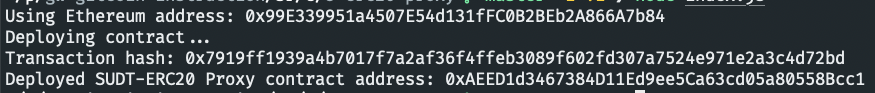
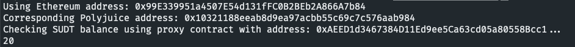
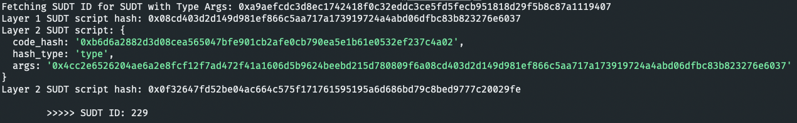

# Task 5

1. A screenshot of the console output immediately after deploying smart contract.


2. The address of the ERC20 Proxy Contract you deployed (in text format).
```
0xAEED1d3467384D11Ed9ee5Ca63cd05a80558Bcc1
```

3. A screenshot of the console output immediately after checking your SUDT balance.


4. The Ethereum address that was checked (in text format).
```
0x99E339951a4507E54d131fFC0B2BEb2A866A7b84
```

<b>Bonus</b>: Get Layer 2 SUDT ID from Layer 1 SUDT Issuer Lock Hash (AKA SUDT Type Args)

