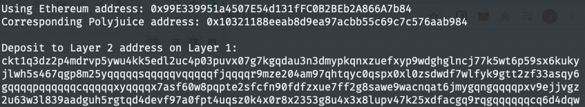

# Task 6

1. A screenshot of the console output immediately after you have successfully generated your Deposit Receiver Address.


2. Your Deposit Receiver Address (in text format).
```
ckt1q3dz2p4mdrvp5ywu4kk5edl2uc4p03puvx07g7kgqdau3n3dmypkqnxzuefxyp9wdghglncj77k5wt6p59sx6kukyjlwh5s467qgp8m25yqqqqqsqqqqqvqqqqqfjqqqqr9mze204am97qhtqyc0qspx0xl0zsdwdf7wlfyk9gtt2zf33asqy6gqqqqpqqqqqqcqqqqqxyqqqqx7asf60w8pqpte2sfcfn90fdfzxue7ff2g8sawe9wacnqat6jmygqngqqqqpxv9ejjvgz2u63w3l839aadguh5rgtqd4devf97a0fpt4uqsz0k4x0r8x2353g8u4x3x8lupv47k25xdfacgq9rqgqqqqqqcq6d4dqw
```

3. The Ethereum address used to generate the Deposit Receiver Address (in text format).
```
0x99E339951a4507E54d131fFC0B2BEb2A866A7b84
```

4. A link to the Etherscan explorer for the successful Force Bridge transaction. This can be found on Force Bridge under History→Succeed.
[https://rinkeby.etherscan.io/tx/0x77e752e2e9337e05fc13916641da2181bf0c1c3b78a3c4a8511475693a071e1f](https://rinkeby.etherscan.io/tx/0x77e752e2e9337e05fc13916641da2181bf0c1c3b78a3c4a8511475693a071e1f)

5. A link to the Nervos explorer for the successful Force bridge transaction. This can be found on Force Bridge under History→Succeed.
[https://explorer.nervos.org/aggron/transaction/0xac25a9f1541e90055a73071a89780a28a7ebe700c5a890c01f76f50eb6fad9e6](https://explorer.nervos.org/aggron/transaction/0xac25a9f1541e90055a73071a89780a28a7ebe700c5a890c01f76f50eb6fad9e6)