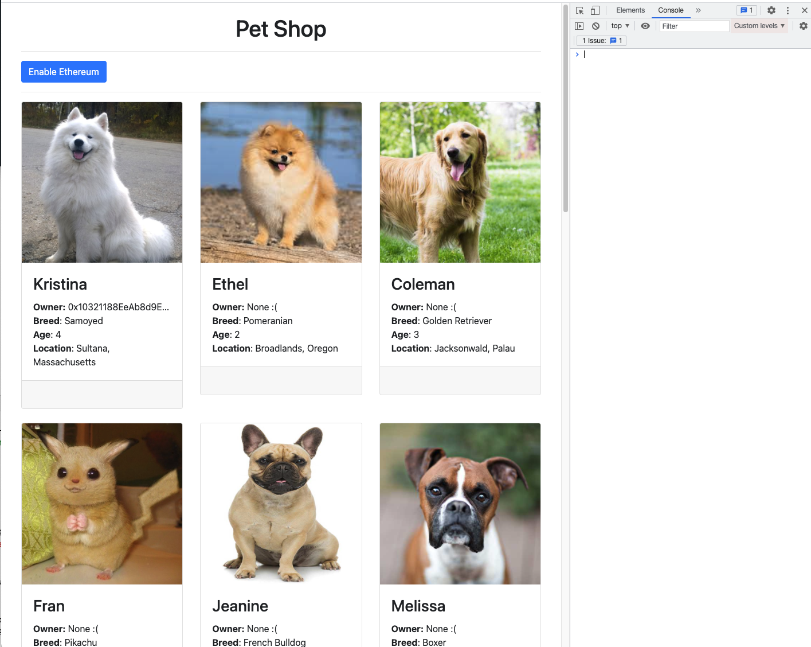
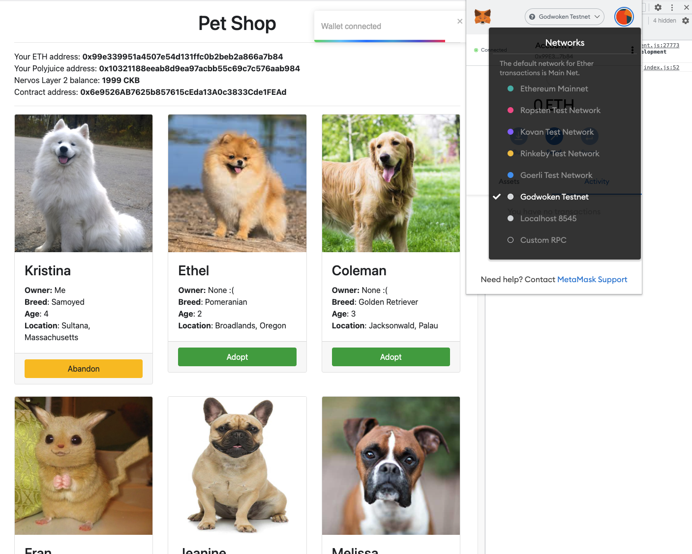
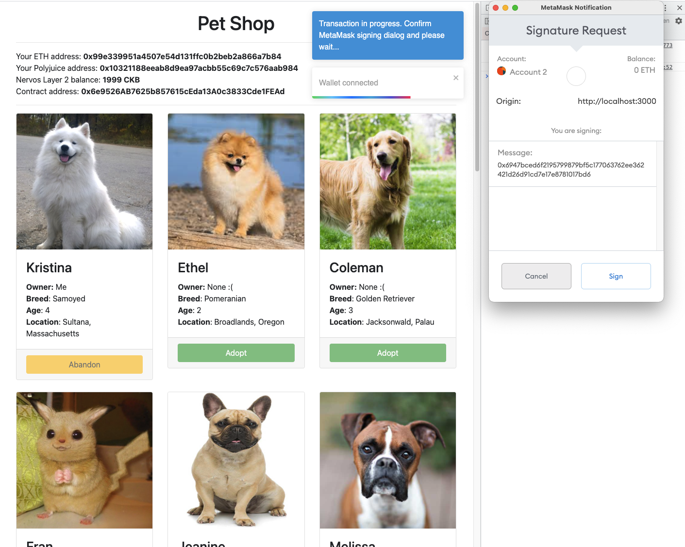
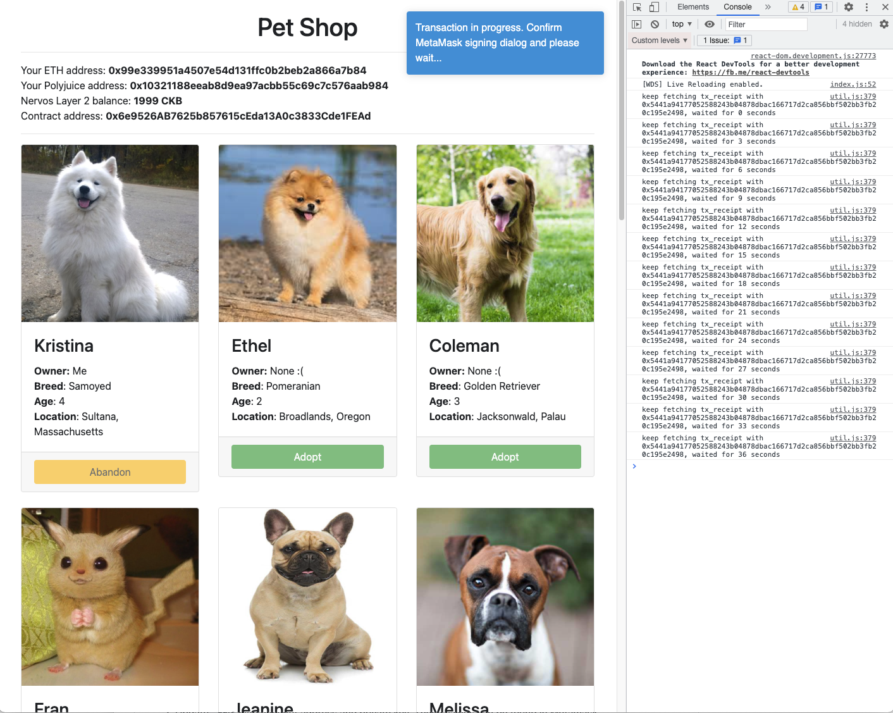
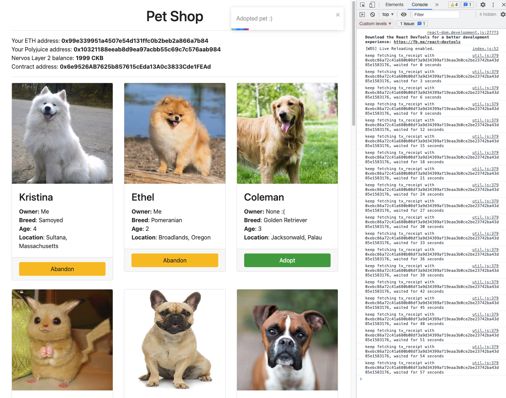

# Task 7

## 1. Media

*Not yet connected to Metamask*

*Connected to Metamask*

*Click adopt Ethel*

*Transacting...*

*Ethel adopted!*

## 2. Github Link
[https://github.com/jinusean/CKB-pet-shop](https://github.com/jinusean/CKB-pet-shop)

## 3. Contract 
### [Contract ABI](./abi.json)
```json
[
  {
    "inputs": [
      {
        "internalType": "uint256",
        "name": "",
        "type": "uint256"
      }
    ],
    "name": "adopters",
    "outputs": [
      {
        "internalType": "address",
        "name": "",
        "type": "address"
      }
    ],
    "stateMutability": "view",
    "type": "function",
    "constant": true
  },
  {
    "inputs": [
      {
        "internalType": "uint256",
        "name": "petId",
        "type": "uint256"
      }
    ],
    "name": "adopt",
    "outputs": [
      {
        "internalType": "uint256",
        "name": "",
        "type": "uint256"
      }
    ],
    "stateMutability": "nonpayable",
    "type": "function"
  },
  {
    "inputs": [
      {
        "internalType": "uint256",
        "name": "petId",
        "type": "uint256"
      }
    ],
    "name": "abandon",
    "outputs": [
      {
        "internalType": "uint256",
        "name": "",
        "type": "uint256"
      }
    ],
    "stateMutability": "nonpayable",
    "type": "function"
  },
  {
    "inputs": [],
    "name": "getAdopters",
    "outputs": [
      {
        "internalType": "address[16]",
        "name": "",
        "type": "address[16]"
      }
    ],
    "stateMutability": "view",
    "type": "function",
    "constant": true
  }
]
```
### Contract Address
[0x6e9526AB7625b857615cEda13A0c3833Cde1FEAd](./contract-address.txt)

### Contract Hash
[0x64d26ce979a75ece563f4245fecdb26935a5dca9674cbe1b3ade371a549f6245](./contract-hash.txt)