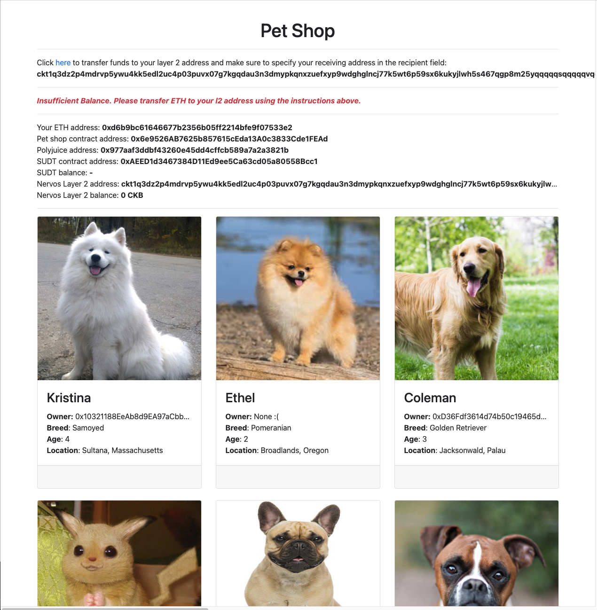
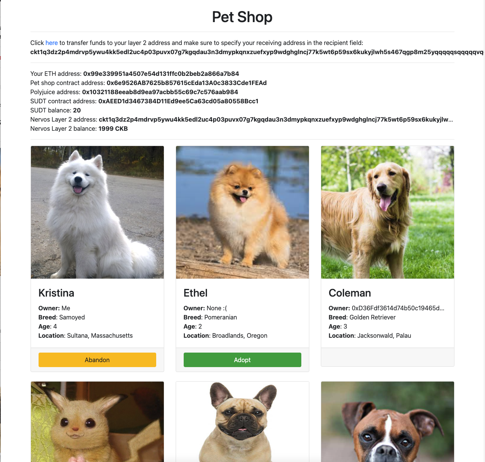

# Task 8

1. A screenshot or video of your EVM application on Layer 2 with Force Bridge support.

*Error prompt with insufficient balance*   

*After depositing funds*

3. The address of the SUDT-ERC20 Proxy Contract that you deployed (in text format).  
[0xAEED1d3467384D11Ed9ee5Ca63cd05a80558Bcc1](./sudt-erc20-address.txt)

4. A link to the GitHub repository with your EVM application that integrates Force Bridge support.  
https://github.com/jinusean/CKB-pet-shop