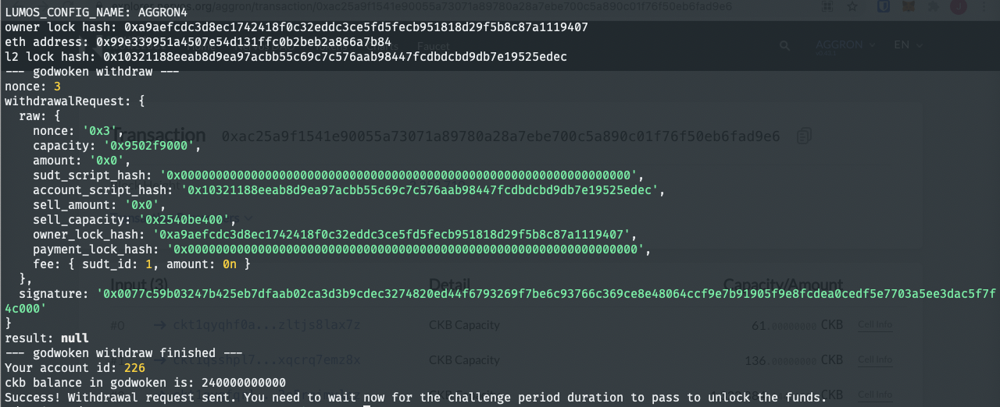

1. A screenshot of the console output immediately after running the withdraw command.

2. The Ethereum address that you've used for your Layer 2 account (in text format).
[0x99E339951a4507E54d131fFC0B2BEb2A866A7b84](./2-eth-address.txt)

3. The Nervos Layer 1 address that you passed to withdraw command (in text format).
[ckt1qyqd0y5q80xypzkrfvg0q0l5ne56c64hex9st3yx9j](./3-nervos-address.txt)